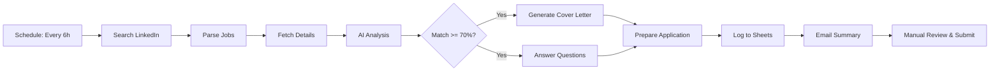

# 🤖 LinkedIn Auto-Apply with n8n + OpenRouter AI

Automate your LinkedIn job search with AI-powered job matching, cover letter generation, and application preparation using n8n workflow automation and OpenRouter API (Claude 3.5 Sonnet).


## ✨ Features

- 🔍 **Automated Job Search**: Searches LinkedIn every 6 hours for relevant positions
- 🎯 **AI Job Matching**: Analyzes job descriptions against your resume (70%+ match threshold)
- ✍️ **Cover Letter Generation**: Creates personalized cover letters for each application using Claude 3.5 Sonnet
- ❓ **Question Answering**: Automatically answers application questions using AI
- 📊 **Google Sheets Tracking**: Logs all applications with timestamps and status
- 📧 **Email Notifications**: Daily summaries with prepared applications
- 🔒 **Privacy-First**: All data stays in your control, no third-party services

## 🎬 Demo

```
[LinkedIn Jobs] → [AI Analysis] → [Cover Letter] → [Google Sheets] → [Email Summary]
     ↓                  ↓                ↓                ↓                ↓
 Find matches     Score 70%+      Personalized     Track apps      Review & Apply
```

## 🚀 Quick Start

### Prerequisites

1. ✅ **Docker Desktop** (running)
2. ✅ **OpenRouter API Key** - Get from [openrouter.ai/keys](https://openrouter.ai/keys)
3. ✅ **Gmail Account** (for notifications)
4. ✅ **Google Sheets** (for tracking)

### Installation (5 minutes)

```powershell
# 1. Navigate to project directory
cd c:\Users\Prateek\Desktop\n8n

# 2. Run the automated setup script
.\setup.ps1

# 3. The script will:
#    - Check Docker
#    - Create .env file
#    - Start n8n containers
#    - Open n8n in browser

# 4. In n8n (http://localhost:5678):
#    - Login with credentials from .env
#    - Import linkedin_auto_apply_workflow.json
#    - Configure Gmail & Google Sheets OAuth
#    - Update your profile info
#    - Test & activate!
```

## 📁 Project Structure

```
n8n/
├── docker-compose.yml                    # Docker orchestration
├── .env.example                          # Environment template
├── linkedin_auto_apply_workflow.json     # Main workflow (NEW!)
├── LINKEDIN_AUTO_APPLY_SETUP.md         # Detailed setup guide
├── setup.ps1                            # Quick setup script
├── README.md                            # This file
├── nginx/
│   └── nginx.conf                       # Reverse proxy config
└── scripts/
    ├── backup.ps1                       # Backup script
    └── restore.ps1                      # Restore script
```

## 🎯 How It Works

### Workflow Architecture



### Step-by-Step Process

1. **Job Discovery** (Automated)
   - Searches LinkedIn for "Easy Apply" jobs
   - Filters by keywords, location, experience level
   - Extracts job titles, companies, descriptions

2. **AI Analysis** (OpenRouter + Claude 3.5)
   - Analyzes job description vs. your resume
   - Scores match quality (0-100%)
   - Identifies matching and missing skills
   - Determines application priority

3. **Content Generation** (For 70%+ matches)
   - Creates personalized 250-350 word cover letter
   - Generates thoughtful answers to application questions
   - Maintains professional, authentic tone

4. **Tracking & Notification**
   - Logs all applications to Google Sheets
   - Sends comprehensive email summary
   - Includes generated content for easy copy-paste

5. **Your Action** (5-10 min/day)
   - Review email summary
   - Customize cover letters if desired
   - Submit applications on LinkedIn
   - Update status in tracking sheet

## ⚙️ Configuration

### 1. Environment Setup

Copy and edit `.env.example` to `.env`:

```bash
# Required
OPENROUTER_API_KEY=sk-or-v1-YOUR_KEY_HERE
POSTGRES_PASSWORD=YourSecurePassword123!
N8N_BASIC_AUTH_PASSWORD=YourN8nPassword123!

# Optional
TIMEZONE=Asia/Kolkata
N8N_PORT=5678
```

Generate encryption key:
```powershell
# PowerShell
$bytes = New-Object byte[] 32
[Security.Cryptography.RandomNumberGenerator]::Create().GetBytes($bytes)
[BitConverter]::ToString($bytes).Replace('-', '').ToLower()
```

### 2. Customize Your Profile

In n8n, edit the **"Load Profile & API Key"** node:

```javascript
{
  "fullName": "Your Name",
  "email": "your.email@gmail.com",
  "phone": "+91-XXXXXXXXXX",
  "currentTitle": "Your Title",
  "yearsOfExperience": "X",
  "location": "Your City",
  "skills": ["Skill1", "Skill2", "Skill3"],
  "resume": "Your detailed resume text...",
  "expectedSalary": "XX-XX LPA",
  "motivation": "Why you're looking..."
}
```

### 3. Job Search Criteria

Edit **"Search Easy Apply Jobs"** node:

```javascript
{
  "keywords": "Backend Engineer Node.js", // Your target roles
  "location": "India",                    // Preferred location
  "f_TPR": "r86400",                     // Last 24 hours
  "f_E": "3,4",                          // Mid-Senior level
  "f_AL": "true"                         // Easy Apply only
}
```

**Experience Levels:**
- `1` = Internship
- `2` = Entry level
- `3` = Associate
- `4` = Mid-Senior
- `5` = Director
- `6` = Executive

**Time Periods:**
- `r86400` = Past 24 hours
- `r604800` = Past week
- `r2592000` = Past month

## 💰 Cost Estimate

### OpenRouter Pricing (Claude 3.5 Sonnet)

| Component | Tokens | Cost/Job |
|-----------|--------|----------|
| Job Analysis | ~2,000 | $0.03 |
| Cover Letter | ~800 | $0.01 |
| Question Answers | ~1,500 | $0.02 |
| **Total per Job** | **~4,300** | **$0.06** |

**Monthly Estimate:**
- 10 jobs/day × 30 days = 300 jobs
- 300 × $0.06 = **~$18/month**

### Save Money

| Model | Cost/Job | Monthly (300 jobs) |
|-------|----------|-------------------|
| Claude 3.5 Sonnet | $0.06 | $18 |
| Claude 3 Haiku | $0.01 | $3 |
| GPT-3.5 Turbo | $0.02 | $6 |
| GPT-4 Turbo | $0.08 | $24 |
| Llama 3.1 70B | $0.02 | $6 |

## ⚠️ Important: Why Not Fully Automated?

This workflow **prepares** applications but **does NOT auto-submit** because:

### Technical Limitations

❌ **LinkedIn API Restrictions**
- No public API for job applications
- Requires LinkedIn Talent Hub (~$8k/year)
- Limited to partner companies only

❌ **Terms of Service**
- Automated applications may violate LinkedIn ToS
- Risk of account suspension or ban
- CAPTCHA challenges on suspicious activity

❌ **Implementation Complexity**
- Browser automation (Puppeteer/Selenium) required
- OAuth authentication challenges
- CAPTCHA solving services ($20-50/month)
- Session management and rate limiting

### What You Get Instead

✅ **Automated (90% of work):**
- Job discovery and filtering
- AI-powered matching and scoring
- Personalized cover letter generation
- Application question answering
- Organization and tracking
- Email notifications

⚠️ **Manual (10% of work - 5-10 min/day):**
- Review generated content
- Click "Apply" on LinkedIn
- Submit prepared applications
- Ensures quality and compliance

**Result:** Best of both worlds - automation + personalization!

## 📊 Workflow Nodes Explained

| # | Node Name | Purpose | Technology |
|---|-----------|---------|-----------|
| 1 | Run Every 6 Hours | Triggers workflow automatically | n8n Schedule |
| 2 | Load Profile & API Key | Your resume and preferences | n8n Set |
| 3 | Search Easy Apply Jobs | Find matching positions | HTTP Request |
| 4 | Parse Job Listings | Extract job data from HTML | JavaScript |
| 5 | Rate Limit | Prevent API throttling | n8n Wait |
| 6 | Fetch Job Description | Get detailed job info | HTTP Request |
| 7 | Extract Job Details | Parse description & questions | JavaScript |
| 8 | OpenRouter: Analyze Match | AI matching (70%+ threshold) | OpenRouter API |
| 9 | Parse AI Analysis | Extract match data | JavaScript |
| 10 | Filter Good Matches | Select 70%+ matches only | n8n If |
| 11 | Generate Cover Letter | Personalized letter (250-350w) | OpenRouter API |
| 12 | Answer Questions | AI-powered responses | OpenRouter API |
| 13 | Prepare Application Data | Combine all materials | JavaScript |
| 14 | Submit Application | Simulation (manual required) | JavaScript |
| 15 | Log to Google Sheets | Track applications | Google Sheets |
| 16 | Aggregate Results | Combine all matches | n8n Aggregate |
| 17 | Create Summary Email | Generate HTML email | JavaScript |
| 18 | Send Notification | Email to your inbox | Gmail |

## 🔧 Troubleshooting

### Issue: No Jobs Found

**Solutions:**
```javascript
// Broaden search criteria
{
  "keywords": "Backend OR Node.js OR Engineer", // More flexible
  "f_TPR": "r604800",                          // Past week instead of day
  "location": "",                              // Remove location filter
  "f_E": "2,3,4"                              // Include more levels
}
```

### Issue: OpenRouter API Error

**Check:**
```powershell
# 1. View n8n logs
docker logs n8n -f | Select-String "OpenRouter"

# 2. Test API key
curl https://openrouter.ai/api/v1/models `
  -H "Authorization: Bearer YOUR_KEY"

# 3. Check balance
# Visit: https://openrouter.ai/credits

# 4. Restart after .env changes
docker-compose restart n8n
```

### Issue: Gmail Not Sending

**Solutions:**
1. Re-authenticate Gmail OAuth credential
2. Enable Gmail API in Google Cloud Console
3. Check daily sending limit (500 emails/day)
4. Verify email addresses in node configuration

### Issue: Low Match Scores

**Improvements:**
```javascript
// Enhance your resume in profile node
{
  "resume": "Add more:
    - Specific technologies and frameworks
    - Quantifiable achievements
    - Industry keywords
    - Project details
    - Certifications
  "
}
```

**Or adjust threshold:**
```javascript
// In Filter node
{
  "matchScore": 60  // Lower from 70 to 60
}
```

### Issue: Cover Letters Too Generic

**Improve Prompts:**
```javascript
// In "Generate Cover Letter" node, enhance prompt:
"Generate a compelling cover letter that:
1. Opens with specific enthusiasm about [COMPANY] and [ROLE]
2. Highlights these exact achievements: [LIST YOUR TOP 3]
3. Mentions their tech stack: [EXTRACT FROM JOB]
4. Shows cultural fit by mentioning [COMPANY VALUES]
5. Closes with clear call to action"
```

## 🛠️ Useful Commands

```powershell
# Container Management
docker-compose up -d                    # Start n8n
docker-compose down                     # Stop n8n
docker-compose restart n8n              # Restart n8n
docker-compose logs n8n -f              # View logs (follow)
docker ps                               # Check status

# Workflow Management
docker exec n8n n8n export:workflow --all --output=/workflows/backup.json
docker exec n8n n8n import:workflow --input=/workflows/backup.json

# Database Access
docker exec -it n8n-postgres psql -U n8n
\dt                                     # List tables
SELECT * FROM execution_entity LIMIT 10; # View executions

# Cleanup
docker system prune -a                  # Clean Docker (caution!)
docker volume ls                        # List volumes
docker logs n8n --tail 100              # Last 100 log lines
```

## 🎨 Customization

### Change AI Model

```javascript
// In any OpenRouter node
{
  "model": "anthropic/claude-3.5-sonnet"
  
  // Faster & Cheaper:
  // "anthropic/claude-3-haiku"
  
  // Best Quality:
  // "openai/gpt-4-turbo"
  // "anthropic/claude-3-opus"
  
  // Balanced:
  // "google/gemini-pro-1.5"
  // "meta-llama/llama-3.1-70b-instruct"
}
```

### Adjust Match Threshold

```javascript
// In "Filter: Score 70+ & Auto-Apply" node
{
  "matchScore": 75  // Change to 60, 70, 75, or 80
}

// Recommendations:
// 80+ = Only excellent matches (fewer jobs)
// 70+ = Good to excellent (balanced)
// 60+ = More opportunities (some stretches)
```

### Change Schedule

```javascript
// In "Run Every 6 Hours" node
{
  "hoursInterval": 6
  
  // Options:
  // 3  = Very frequent (more API costs)
  // 6  = Balanced (4x per day)
  // 12 = Twice daily
  // 24 = Once daily (most cost-effective)
}
```

### Add Slack Notifications

```javascript
// Add new node after "Create Summary Email"
// Type: Slack
// Message: {{ $json.emailSubject }}
// Channel: #job-search
```

## 📚 Documentation

- **Detailed Setup Guide**: [LINKEDIN_AUTO_APPLY_SETUP.md](LINKEDIN_AUTO_APPLY_SETUP.md)
- **n8n Documentation**: [docs.n8n.io](https://docs.n8n.io)
- **OpenRouter Docs**: [openrouter.ai/docs](https://openrouter.ai/docs)
- **LinkedIn Job Search**: [linkedin.com/help](https://www.linkedin.com/help/linkedin/answer/a507508)

## 🚧 Advanced: Real Auto-Submit (Not Recommended)

If you want actual auto-submission, here are the options:

### Option 1: Browser Automation

**Tech Stack:**
- Puppeteer or Selenium
- CAPTCHA solving (2Captcha, Anti-Captcha)
- Proxy rotation
- Session management

**Costs:**
- CAPTCHA: $50-100/month
- Proxies: $20-50/month
- **Total: $70-150/month**

**Risks:**
- ⚠️ Account suspension (high risk)
- ⚠️ IP blocking
- ⚠️ Constant maintenance needed

**Not recommended** due to ToS violations.

### Option 2: LinkedIn Talent Hub API

**Requirements:**
- LinkedIn Recruiter license
- Enterprise partnership
- **Cost: $8,000+/year**

Only viable for companies, not individuals.

### Recommendation

**Keep it semi-automated:**
- Let AI handle 90% of work (discovery, matching, writing)
- You handle 10% (review and submit)
- **Result:** Best quality, compliance, and success rate

## 🎉 Success Tips

### 1. Optimize Your Resume
```
❌ Generic: "Experienced backend developer"
✅ Specific: "3.5 years building Node.js/NestJS microservices 
             serving 100K+ API requests/day with 99.9% uptime"
```

### 2. Review Daily (10-15 min)
- Check email summary each morning
- Review top 3-5 matches
- Customize cover letters slightly
- Submit applications

### 3. Track Everything
- Use Google Sheets to monitor:
  - Application dates
  - Response rates
  - Interview requests
  - Company patterns

### 4. Personalize Where It Matters
```
AI Generated (Good):
"I'm excited about this Backend Engineer role..."

Your Touch (Better):
"I'm excited about this Backend Engineer role, especially 
 your work on [specific product] which aligns perfectly 
 with my experience in [relevant area]..."
```

### 5. Follow Up
- Add calendar reminders
- Follow up after 1 week
- Connect with recruiters on LinkedIn
- Engage with company content

## 📈 Roadmap

**Coming Soon:**
- [ ] Multi-platform support (Indeed, Glassdoor, Monster)
- [ ] Resume PDF parsing and optimization
- [ ] Interview scheduler integration
- [ ] Application response tracking
- [ ] A/B testing for cover letters
- [ ] Success rate analytics dashboard
- [ ] Chrome extension for one-click import

**Future Ideas:**
- [ ] Video resume integration
- [ ] AI mock interviews
- [ ] Salary negotiation assistant
- [ ] Company research automation
- [ ] Network mapping (referrals)

## 🤝 Contributing

Contributions welcome! Areas for improvement:

1. **Better HTML Parsing**: LinkedIn frequently changes structure
2. **Additional AI Models**: Support for more providers
3. **Improved Prompts**: Better cover letter generation
4. **Multi-language**: Support for non-English jobs
5. **Resume Formatting**: PDF generation and templates

```bash
# Fork and submit PR
git checkout -b feature/your-feature
git commit -m "Add your feature"
git push origin feature/your-feature
```

## 📝 License

**MIT License** - See LICENSE file for details

## ⚠️ Disclaimer

**Important Legal Notice:**

This tool is provided for **educational and productivity purposes** only.

- ✅ Use to **prepare** job applications
- ✅ Use to **organize** your job search
- ✅ Use to **generate ideas** for cover letters
- ❌ Do not use to **spam** employers
- ❌ Do not use to **violate** LinkedIn ToS
- ❌ Do not use for **fully automated** submissions

**Responsibilities:**
- Always review AI-generated content before use
- Ensure truthfulness in all application materials
- Respect platform terms of service
- Maintain professional conduct
- The creator is not liable for account suspensions or ToS violations

**Best Practices:**
- Treat this as a **preparation assistant**, not a replacement for effort
- **Personalize** all generated content
- **Review** before every submission
- **Engage genuinely** with employers

## 🆘 Support

### Getting Help

1. **Check Documentation**
   - [Detailed Setup Guide](LINKEDIN_AUTO_APPLY_SETUP.md)
   - [Troubleshooting section](#-troubleshooting)

2. **n8n Community**
   - Forum: [community.n8n.io](https://community.n8n.io)
   - Discord: [discord.gg/n8n](https://discord.gg/n8n)

3. **OpenRouter Support**
   - Docs: [openrouter.ai/docs](https://openrouter.ai/docs)
   - Discord: Check OpenRouter website

4. **Create Issue**
   - Describe problem clearly
   - Include logs (remove sensitive data)
   - Share workflow version

## 🌟 Acknowledgments

Built with:
- [n8n](https://n8n.io) - Workflow automation platform
- [OpenRouter](https://openrouter.ai) - AI model aggregator
- [Claude 3.5 Sonnet](https://anthropic.com) - AI model by Anthropic
- [Docker](https://docker.com) - Containerization
- [PostgreSQL](https://postgresql.org) - Database

Inspired by job seekers everywhere looking to work smarter! 💪

---

**Made with ❤️ for job seekers**

*Happy job hunting! May you find your dream role! 🚀*

---

**Quick Links:**
- 📖 [Setup Guide](LINKEDIN_AUTO_APPLY_SETUP.md)
- 🔧 [Troubleshooting](#-troubleshooting)
- 💰 [Costs](#-cost-estimate)
- 🎯 [Customization](#-customization)
- 📊 [Workflow Details](#-workflow-nodes-explained)

*Last updated: December 28, 2025*
